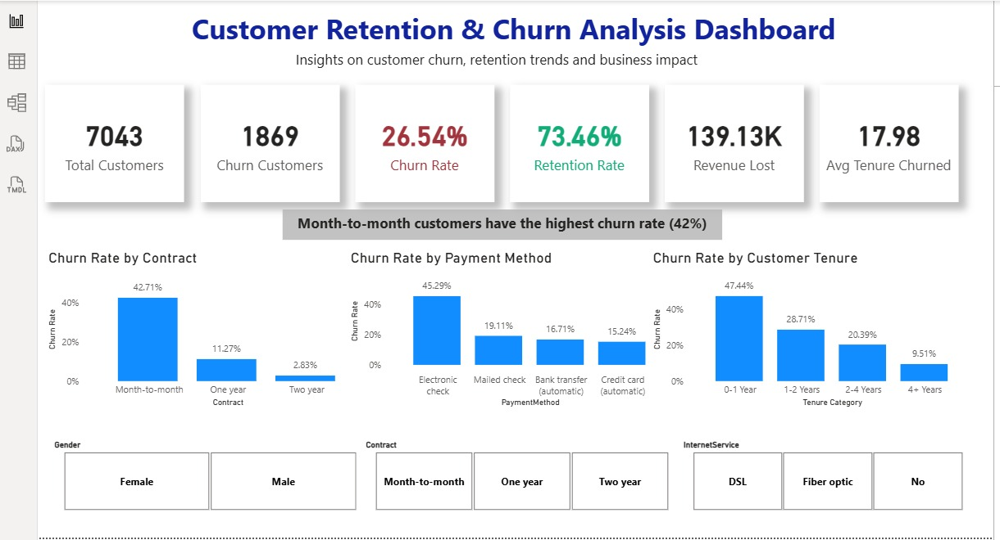
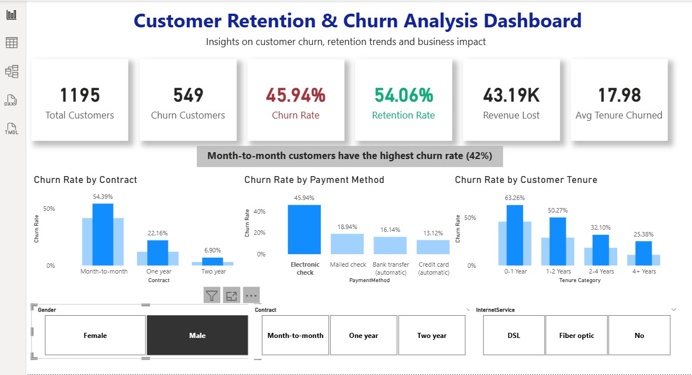
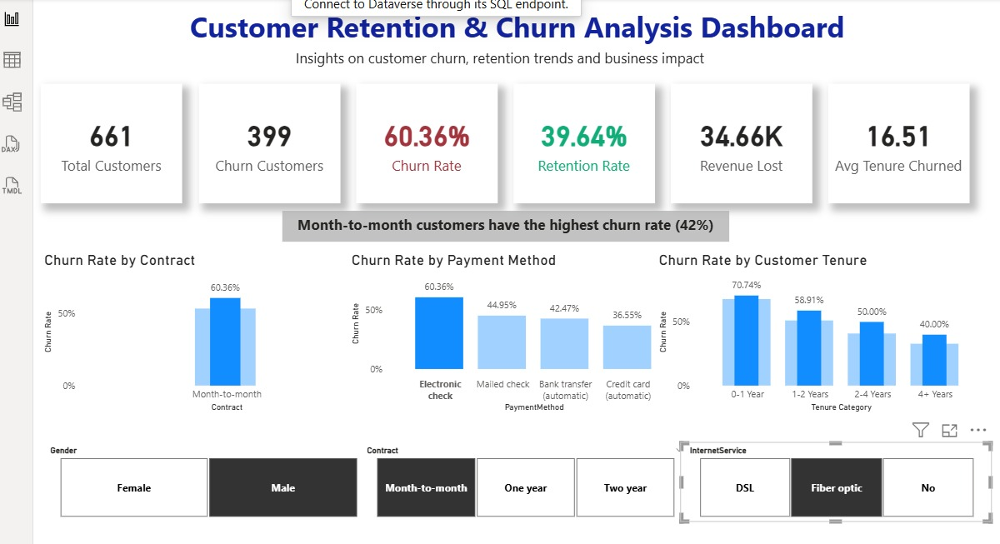
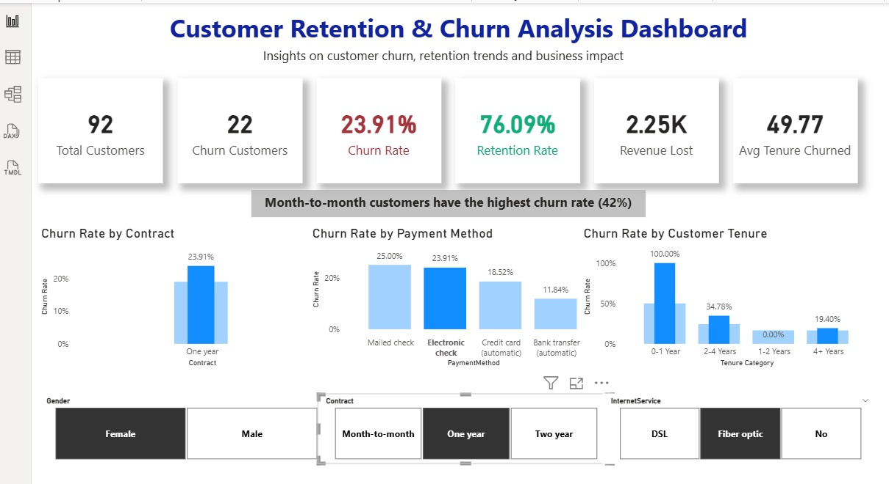
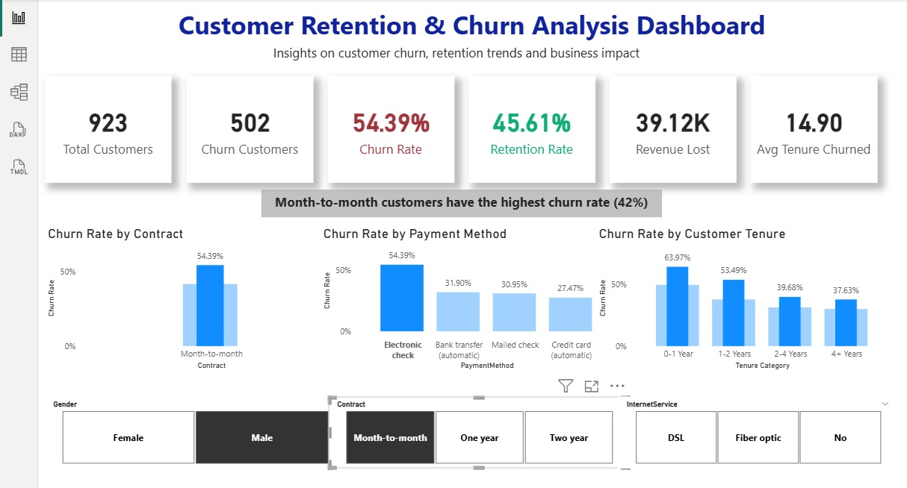

# 📊 Customer Retention & Churn Analysis  
### Data Science & Analytics — Task 2 (2026) | Future Interns  

---

## 📌 Objective  

The objective of this task is to analyze customer behavior and identify patterns behind **customer churn and retention**.  

This project focuses on answering key business questions such as:  

- Why are customers leaving?  
- Which customer segments have the highest churn?  
- How does customer tenure affect retention?  
- What actions can improve long-term customer engagement?  

---

## 🛠️ Tools & Technologies  

| Tool | Purpose |
|---|---|
| **Power BI Desktop** | Dashboard development & data visualization |
| **Telco Customer Churn Dataset** | Customer behavior & churn analysis |

---

## 📂 Dataset  

- **Name:** Telco Customer Churn Dataset  
- **Source:** https://www.kaggle.com/datasets/blastchar/telco-customer-churn  
- **Domain:** Telecom / Subscription-based business  

### 🔑 Key Features  

- Customer ID  
- Gender  
- Tenure  
- Contract Type  
- Payment Method  
- Monthly Charges  
- Internet Service  
- Churn (Yes/No)  

---

## 🛠️ Data Preparation & Transformation  

### 🔹 Data Cleaning  
- Handled missing and null values  
- Ensured correct data types (categorical & numerical)  

### 🔹 Data Transformation  
- Created calculated measures:  
  - **Churn Rate (%)**  
  - **Retention Rate (%)**  
  - **Revenue Lost**  
- Created custom column:  
  - **Tenure Groups** (0–1 Year, 1–2 Years, 2–4 Years, 4+ Years)  

### 🔹 Data Modeling  
- Applied relationships and aggregations  
- Built dynamic measures for real-time filtering  

---

## 📊 Dashboard Overview  

The Power BI dashboard provides a complete view of customer churn behavior through KPIs and visual insights.

### 💰 KPI Summary Cards  

| Metric | Description |
|---|---|
| Total Customers | Total number of customers |
| Churn Customers | Customers who left |
| Churn Rate | % of customers who churned |
| Retention Rate | % of customers retained |
| Revenue Lost | Estimated revenue loss due to churn |
| Avg Tenure Churned | Average duration before churn |

---

### 📉 Churn Analysis  

#### 📊 Churn by Contract  
- Month-to-month contracts show the highest churn (~42%+)  
- Long-term contracts significantly reduce churn  

#### 💳 Churn by Payment Method  
- Electronic check users have the highest churn  
- Automatic payment methods show lower churn rates  

#### ⏳ Churn by Customer Tenure  
- Customers in 0–1 year category churn the most  
- Long-term customers (4+ years) are more stable  

---

### 🔘 Interactive Filters  

- Gender  
- Contract Type  
- Internet Service  

---

## 💡 Key Business Insights  

- ⚠️ Month-to-month customers are the highest churn segment  
- 💳 Electronic check users are more likely to churn  
- ⏳ Most churn occurs within the first year  
- 📉 Churn directly impacts revenue loss  
- 📈 Long-term contracts and auto-pay improve retention  

---

## 🎯 Recommendations  

- Offer incentives to convert month-to-month users into long-term contracts  
- Encourage auto-payment methods  
- Improve onboarding for new customers  
- Implement early churn detection strategies  
- Reward long-term customers  

---

## 📸 Dashboard Preview  

  
  
  
  
  

---

## 🚀 Outcome  

This project demonstrates how customer data can be transformed into **actionable business insights** using Power BI.  

### 🔥 Skills Demonstrated  

- Customer churn & retention analysis  
- Customer segmentation  
- KPI design & dashboard storytelling  
- Business insight generation  
- Data-driven decision making  

---

## 📂 Project Files  

| File | Description |
|---|---|
| `Churn_Dashboard.pbix` | Power BI dashboard file |
| `Dashboard-1.jpeg` | Dashboard view 1 |
| `Dashboard-2.jpeg` | Dashboard view 2 |
| `Dashboard-3.jpeg` | Dashboard view 3 |
| `Dashboard-4.jpeg` | Dashboard view 4 |
| `Dashboard-5.jpeg` | Dashboard view 5 |

---

## 🔗 Internship  

This project was completed as part of the **Future Interns — Data Science & Analytics Internship Program (2026)**.  

https://www.linkedin.com/company/future-interns/  

---

## 📢 Conclusion  

Customer retention is a critical factor in subscription-based businesses.  

This project highlights how analyzing churn patterns helps businesses:  

- Reduce customer loss  
- Improve engagement  
- Increase long-term revenue  

---

⭐ If you found this useful, feel free to star the repository!
